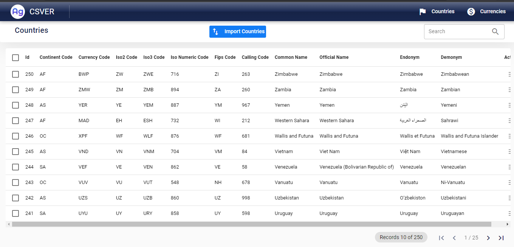
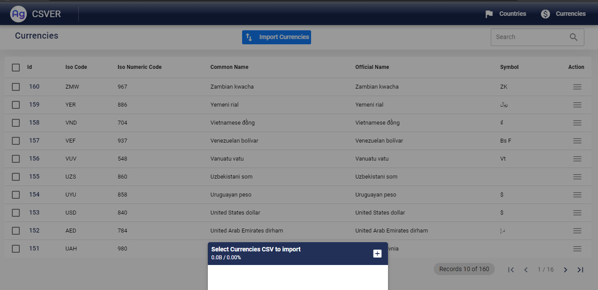

# AG CSVER  v1.0.0

A simple application to import countries and currencies database from CSV file. 

This project comes in Two-part namely the Frontend Part and the Backend Part.

The Backend was built using ```PHP Laravel``` with ```My SQL database``` and the Frontend was built using ```Quasar VueJS``` which gives us a lot of opportunities to deploy on multi-platforms.

Built this project currently for the Web using ```Single Page Application (SPA)```.


## ***PREVIEW***

| COUNTRIES PAGE | CURRENCIES PAGE |
|  ------------- | ------------- 
| | |


# FRONTEND PART
For the frontend to work perfectly, the following should be followed. Navigate to the ```frontend folder```
 first


## Install the dependencies
```bash
npm install
```


>Make sure  Quasar CLI is installed before running quasar

```
npm install -g @quasar/cli 
```


### Start the app in development mode (hot-code reloading, error reporting, etc.)
```bash
quasar dev
```


### Build the app for production
```bash
quasar build
```


### Customize the configuration
See [Configuring quasar.conf.js](https://quasar.dev/quasar-cli/quasar-conf-js).


# BACKEND PART
The Backend was built using Laravel. It is a web application framework with expressive, elegant syntax. We believe development must be an enjoyable and creative experience to be truly fulfilling. Laravel takes the pain out of development by easing common tasks used in many web projects, such as:

- [Simple, fast routing engine](https://laravel.com/docs/routing).
- [Powerful dependency injection container](https://laravel.com/docs/container).
- Multiple back-ends for [session](https://laravel.com/docs/session) and [cache](https://laravel.com/docs/cache) storage.
- Expressive, intuitive [database ORM](https://laravel.com/docs/eloquent).
- Database agnostic [schema migrations](https://laravel.com/docs/migrations).
- [Robust background job processing](https://laravel.com/docs/queues).
- [Real-time event broadcasting](https://laravel.com/docs/broadcasting).

Laravel is accessible, powerful, and provides tools required for large, robust applications.


### Sample  Command


> Create CountriesController Unit Test
````
php artisan make:test --unit CountriesControllerTest
````


> Create CurrenciesController Unit Test
````
php artisan make:test --unit CurrenciesControllerTest
````


>  Clear all compiled view files
````
php artisan view:clear
````

>  Remove the route cache file
````
php artisan route:clear
````


# TOOLS USED
- COMPOSER
- GIT and GITHUB
- VS CODE 
- PHPSTORM
- POSTMAN
- XAMPP


# TODO

- [x] Launch the project on a live server.


- [ ] More Testings


# LIVE URL 
- [Click to visit live project](http://test.tanacom.io).


